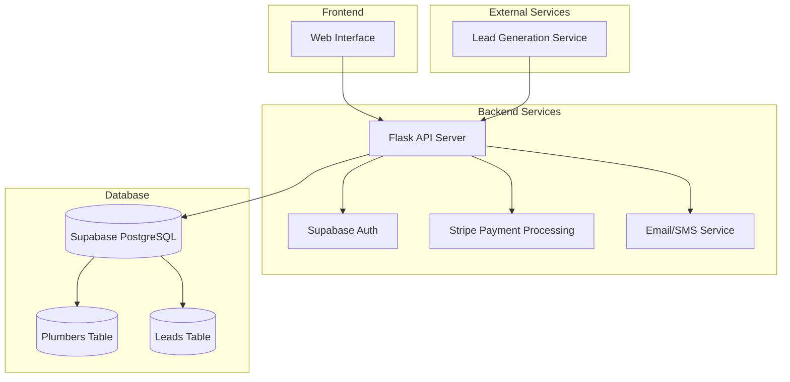

# Plumber Leads Platform - Architecture Documentation

## System Overview

The Plumber Leads Platform is built using the following technology stack:

- **Backend**: Python Flask Framework
- **Authentication**: Supabase
- **Database**: Supabase (PostgreSQL)
- **Payment Processing**: Stripe
- **CI/CD**: GitLab
- **Hosting**: Digital Ocean Droplet

## Architecture Diagram



## Database Schema

### Plumbers Table

```sql
CREATE TABLE plumbers (
    id UUID PRIMARY KEY DEFAULT uuid_generate_v4(),
    first_name VARCHAR(100) NOT NULL,
    last_name VARCHAR(100) NOT NULL,
    email VARCHAR(255) NOT NULL UNIQUE,
    phone_number VARCHAR(20) NOT NULL,
    zip_code VARCHAR(10) NOT NULL,
    services JSONB NOT NULL,
    stripe_customer_id VARCHAR(255),
    created_at TIMESTAMP WITH TIME ZONE DEFAULT NOW(),
    updated_at TIMESTAMP WITH TIME ZONE DEFAULT NOW()
);
```

### Leads Table

```sql
CREATE TABLE leads (
    id UUID PRIMARY KEY DEFAULT uuid_generate_v4(),
    first_name VARCHAR(100) NOT NULL,
    last_name VARCHAR(100) NOT NULL,
    email VARCHAR(255) NOT NULL,
    phone_number VARCHAR(20) NOT NULL,
    service_needed VARCHAR(100) NOT NULL,
    urgency VARCHAR(20) NOT NULL CHECK (urgency IN ('day', 'week', 'month')),
    status VARCHAR(20) DEFAULT 'new' CHECK (status IN ('new', 'assigned', 'completed')),
    assigned_plumber_id UUID REFERENCES plumbers(id),
    created_at TIMESTAMP WITH TIME ZONE DEFAULT NOW(),
    updated_at TIMESTAMP WITH TIME ZONE DEFAULT NOW()
);
```

## Environment Variables

The following environment variables are required and should be set in GitLab CI/CD variables:

```plaintext
SUPABASE_URL: Your Supabase project URL
SUPABASE_KEY: Your Supabase anon/public key
SUPABASE_SERVICE_KEY: Your Supabase service role key
ADMIN_EMAIL: Admin user email
ADMIN_PASSWORD: Admin user password
DB_PASSWORD: PostgreSQL database password
STRIPE_API_KEY: Your Stripe secret key
STRIPE_WEBHOOK_SECRET: Your Stripe webhook signing secret
EMAIL_SERVICE_API_KEY: Your email service API key
SMS_SERVICE_API_KEY: Your SMS service API key
```

## Security Considerations

1. All sensitive data is stored in GitLab CI/CD variables
2. Database access is restricted through Supabase RLS policies
3. API endpoints are protected with authentication
4. Stripe webhook signatures are verified
5. All API requests are validated before processing 