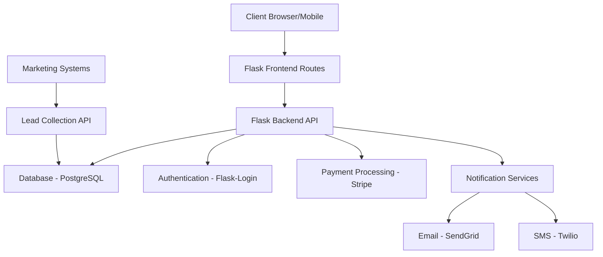

# PlumberLeads System Architecture

## Overview

PlumberLeads is a mobile-first web application that connects plumbers with potential customers through a lead generation and management system. This document outlines the high-level architecture, technology stack, and system components.

## Technology Stack

### Frontend
- **Framework**: HTML5, CSS3, JavaScript
- **Styling**: Custom CSS with responsive design
- **State Management**: Vanilla JavaScript
- **Authentication UI**: Custom forms integrated with Flask-Login

### Backend
- **API Framework**: Python Flask
- **Database**: PostgreSQL (self-hosted on Digital Ocean)
- **Authentication**: Flask-Login
- **Payment Processing**: Stripe
- **Hosting**: Digital Ocean Droplets

### Third-Party Services
- **Email Service**: SendGrid
- **SMS Notifications**: Twilio
- **Analytics**: Google Analytics
- **Lead Generation**: Facebook Ads API, Google Ads API

## System Components

### 1. Authentication System
- Registration and login for plumbers
- Role-based access control (Admin/Plumber)
- Secure password management
- Session-based authentication

### 2. Lead Management System
- Lead collection from marketing channels
- Lead validation and enrichment
- Lead assignment and claiming mechanisms
- Lead status tracking

### 3. Payment Processing System
- Secure payment collection via Stripe
- Subscription management for plumbers
- Per-lead payment options
- Transaction history and reporting

### 4. Notification System
- Real-time notifications for new leads
- Email alerts for lead status changes
- SMS notifications for time-sensitive leads
- In-app notification center

### 5. Admin Dashboard
- Lead monitoring and management
- Plumber account management
- System performance analytics
- Marketing campaign effectiveness reporting

### 6. Plumber Dashboard
- Profile management
- Service area configuration
- Lead browsing and claiming
- Payment history and accounting

## System Architecture Diagram

## Data Flow

### Lead Generation Flow
1. Marketing campaigns generate potential customer inquiries
2. Lead details are collected and stored in the database
3. Leads are validated and categorized by service type and location
4. Available plumbers in the matching service area are notified
5. Plumbers can view and claim leads based on their subscription

### Lead Claiming Flow
1. Plumber receives notification of new lead in their service area
2. Plumber reviews lead details through mobile interface
3. Plumber pays for/claims the lead
4. Plumber receives full contact information
5. Lead status is updated to "claimed"
6. Admin is notified of the successful claim

## Security Considerations

### Data Protection
- All PII (Personally Identifiable Information) is encrypted at rest
- HTTPS for all connections
- Database access restricted through role-based permissions
- Regular security audits and penetration testing

### Payment Security
- PCI-DSS compliance through Stripe
- No storage of credit card details on our servers
- Secure payment processing through tokenization

## Scalability Considerations

### Horizontal Scaling
- Load balancing across multiple Digital Ocean Droplets
- Stateless API design for horizontal scaling
- Web server configured with Gunicorn and Nginx

### Database Scaling
- Read replicas for high-traffic periods
- Efficient indexing for common query patterns
- Query optimization for lead search and filtering

## Disaster Recovery

- Daily database backups to Digital Ocean Spaces
- Multi-region data replication
- Documented recovery procedures
- Regular recovery testing

## Monitoring and Logging

- Comprehensive API request logging using Python logging
- Error tracking with Sentry
- Performance monitoring with Prometheus and Grafana
- User activity auditing for security purposes

## Future Architecture Considerations

- Microservices architecture for specific components
- Real-time chat between plumbers and leads
- AI-based lead scoring and matching
- Mobile native applications for iOS and Android 