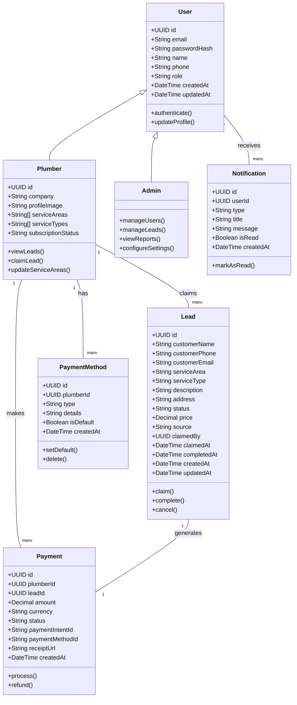
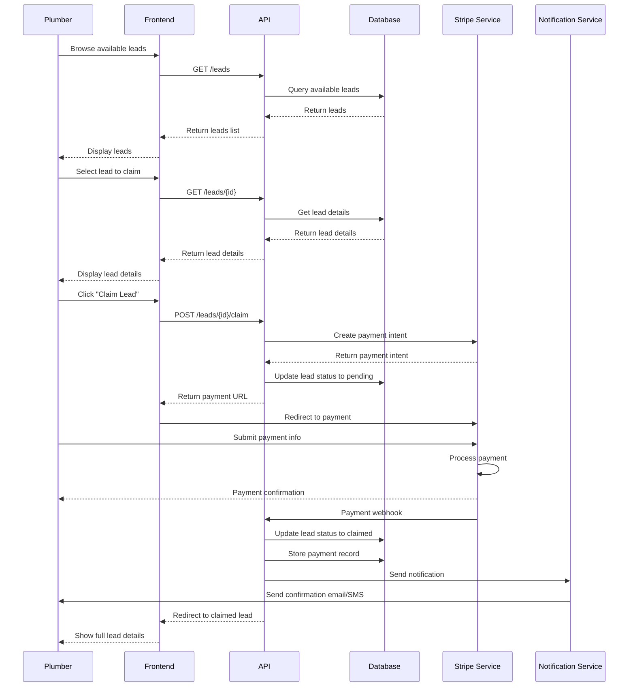
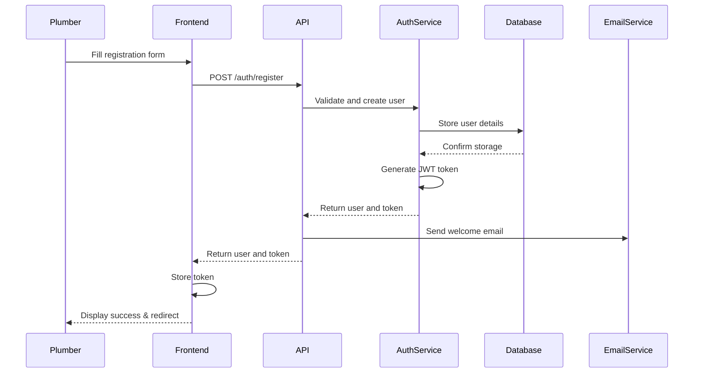
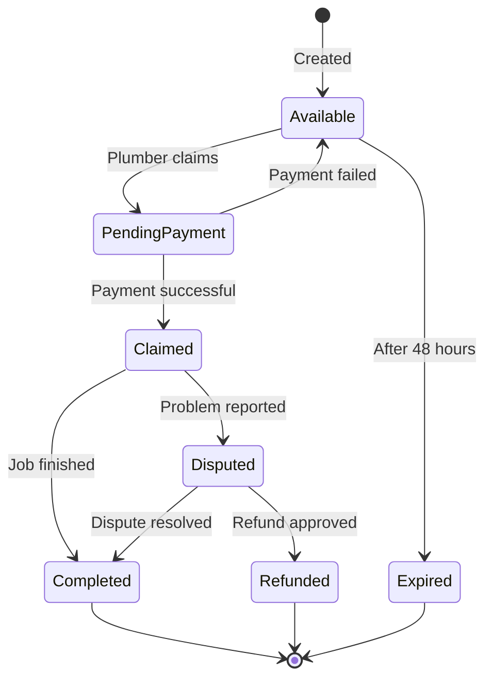
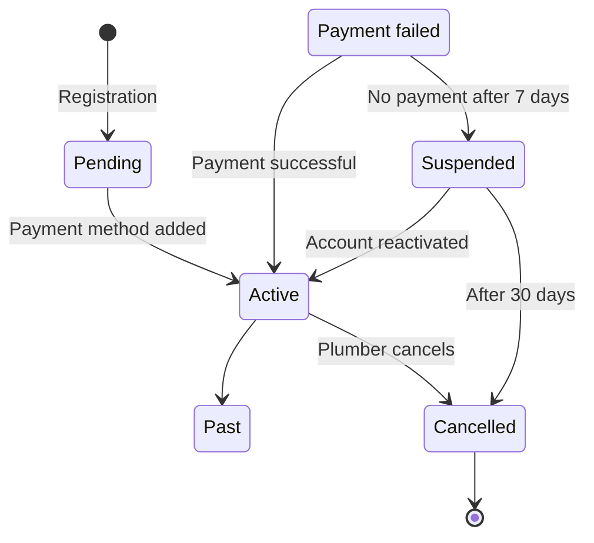
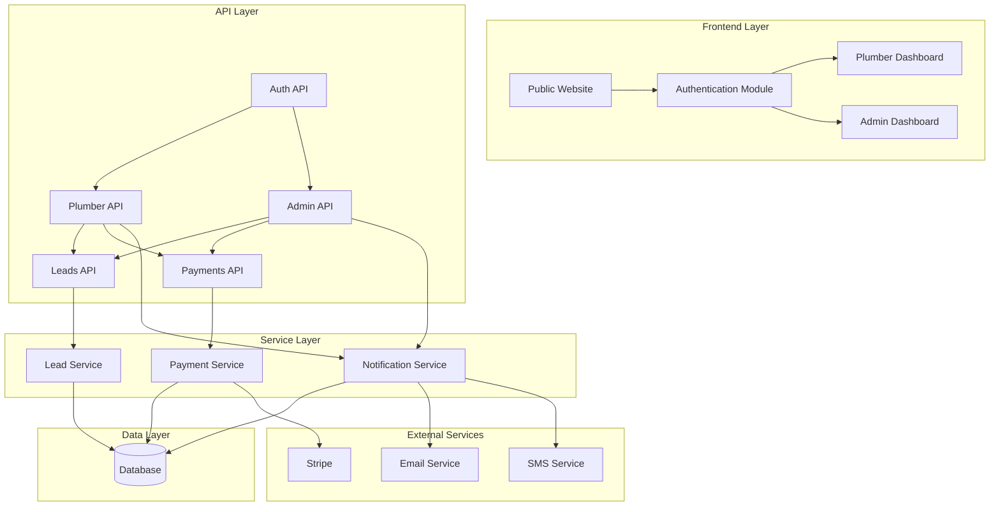
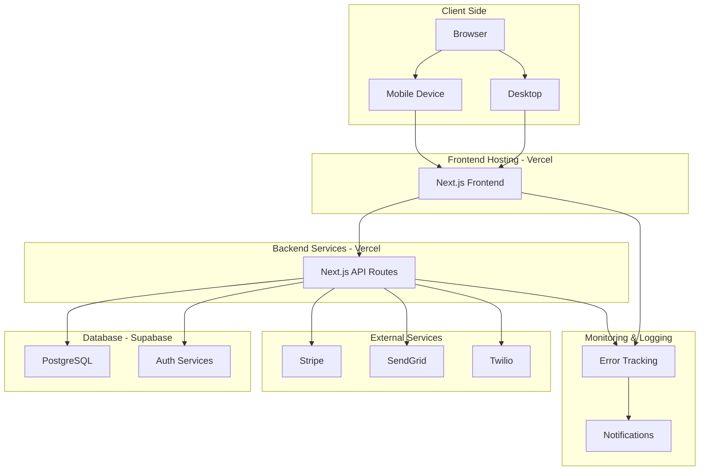

# PlumberLeads UML Diagrams

This document contains various UML diagrams representing the architecture and behavior of the PlumberLeads system.

## Class Diagrams

### Core Domain Model

## Sequence Diagrams

### Lead Claiming Process

### User Registration Process

## State Diagrams

### Lead Lifecycle

### Plumber Subscription States

## Component Diagram

## Deployment Diagram

## Use Case Diagram

```mermaid
graph TD
    subgraph "Actors"
    A((Plumber))
    B((Admin))
    C((System))
    end
    
    subgraph "Authentication"
    A --> D[Register Account]
    A --> E[Login]
    A --> F[Reset Password]
    B --> E
    end
    
    subgraph "Lead Management"
    A --> G[Browse Leads]
    A --> H[View Lead Details]
    A --> I[Claim Lead]
    A --> J[Mark Lead Completed]
    B --> K[Create Lead]
    B --> L[Edit Lead]
    B --> M[Delete Lead]
    C --> N[Generate Leads from Ads]
    end
    
    subgraph "Payment Processing"
    A --> O[Pay for Lead]
    A --> P[Add Payment Method]
    A --> Q[View Payment History]
    B --> R[Issue Refund]
    end
    
    subgraph "Profile Management"
    A --> S[Update Profile]
    A --> T[Configure Service Areas]
    A --> U[Update Subscription]
    end
    
    subgraph "Admin Tasks"
    B --> V[Manage Plumbers]
    B --> W[View Reports]
    B --> X[Configure Settings]
    end
```

These diagrams provide a comprehensive visualization of the PlumberLeads system architecture, behavior, and relationships between components. 