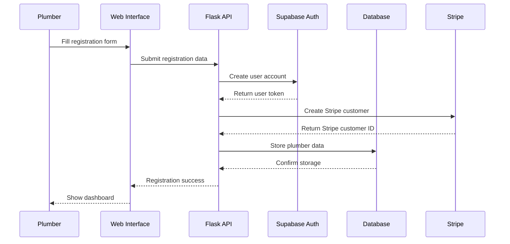
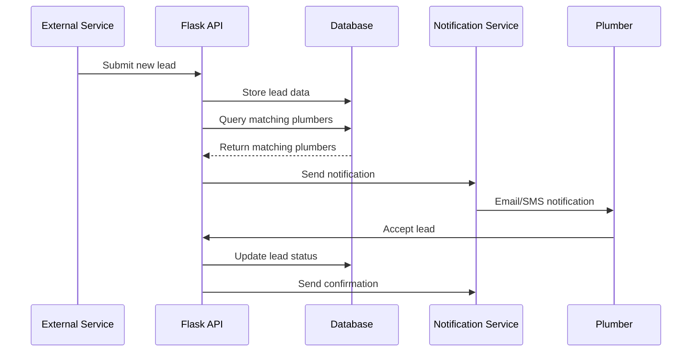
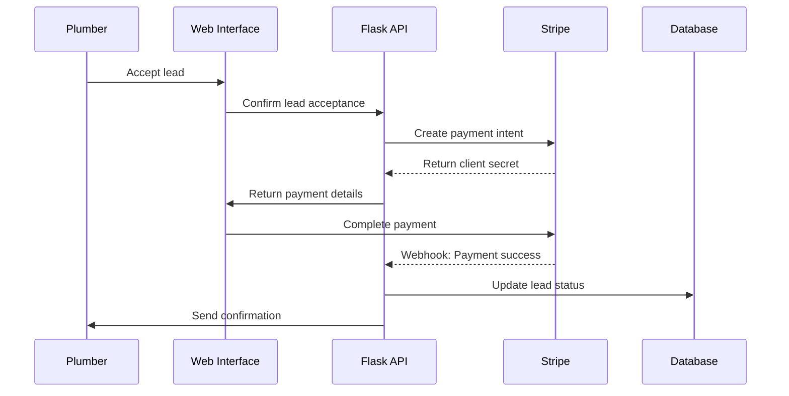
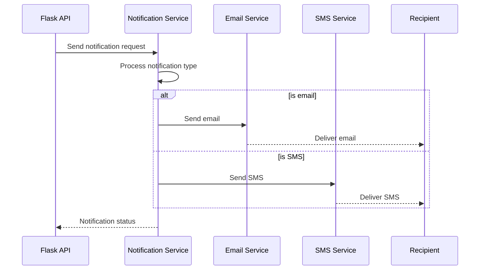

# Sequence Diagrams

This document outlines the key flows in the Plumber Leads Platform using sequence diagrams.

## Plumber Registration Flow

## Lead Assignment Flow

## Payment Processing Flow

## Notification Flow

